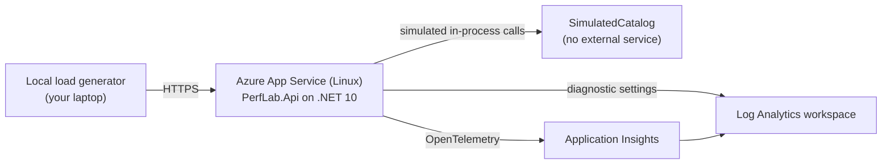

# Session 8 — Hands-on Lab: Diagnose and Remediate Azure App Service Performance Issues

A small, disposable, instructor-led lab that teaches one idea:

> **An application can be slow on Azure App Service without App Service being the root cause.**
> Start with customer impact, correlate platform and application evidence, find the
> inefficient application behaviour, fix it, and prove the improvement with the same workload.

This repository contains everything needed to run the session: the application, the
infrastructure, the deployment automation, a local load generator, the instructor and
participant material, a validation workflow, and the cleanup scripts.

> **This is a controlled educational simulation.** It does not reproduce any customer's
> production architecture, and it does not validate any customer's environment. The "slow
> dependency" is simulated inside the application process — no database or external service
> is deployed or called.

---

## What gets deployed

| # | Resource | Why it is required |
|---|---|---|
| 1 | Resource group | One disposable container so the whole lab is deleted in one action |
| 2 | Log Analytics workspace | Required backing store for workspace-based Application Insights, and the destination for App Service platform logs |
| 3 | Application Insights | Request, dependency, trace and exception correlation — the evidence used in the investigation |
| 4 | Linux App Service Plan | Compute for the app. One instance. No autoscale |
| 5 | Linux App Service | The application under investigation |

Nothing else. No Front Door, Application Gateway, API Management, Azure Load Testing, SQL,
Cosmos DB, Redis, Service Bus, Functions, VNet, private endpoints, Key Vault, container
registry, Kubernetes, or virtual machines. The value of the lab is the troubleshooting
workflow, not the infrastructure.



---

## Prerequisites

- An Azure subscription where you can create a resource group
- [Azure CLI](https://learn.microsoft.com/cli/azure/install-azure-cli) 2.60 or later, signed in with `az login`
- [.NET SDK 10.0](https://dotnet.microsoft.com/download) (the app targets the current LTS runtime)
- **PowerShell 7 (`pwsh`)** or Bash — the `.ps1` scripts declare `#Requires -Version 7.0`, because Windows PowerShell 5.1 writes zip entries with backslash separators that Linux App Service rejects
- Roughly 10 minutes for the first deployment

### Try it without spending anything

Validate the template against Azure and preview exactly what would be created. Resource
groups are not billed, so this costs nothing:

```powershell
./scripts/deploy.ps1 -ResourceGroup rg-perflab-demo -Location eastus -ValidateOnly
```

```bash
./scripts/deploy.sh -g rg-perflab-demo -l eastus -v
```

To check the application behaviour with no Azure resources at all, run
`pwsh ./scripts/smoke-test.ps1`.

---

## Quick start

```powershell
# 1. Deploy (about 4-6 minutes)
./scripts/deploy.ps1 -ResourceGroup rg-perflab-demo -Location eastus

# 2. Reproduce the customer complaint
./scripts/run-load.ps1 -Url https://<your-site>.azurewebsites.net -Label before

# 3. Investigate  ->  docs/participant-lab.md

# 4. Remediate
./scripts/set-mode.ps1 -ResourceGroup rg-perflab-demo -Mode Optimized

# 5. Prove the improvement with the identical workload
./scripts/run-load.ps1 -Url https://<your-site>.azurewebsites.net -Label after

# 6. Delete everything
./scripts/cleanup.ps1 -ResourceGroup rg-perflab-demo
```

Bash equivalents live next to each script (`deploy.sh`, `run-load.sh`, `set-mode.sh`,
`reset.sh`, `cleanup.sh`).

---

## Repository layout

```
├── src/PerfLab.Api/            ASP.NET Core Minimal API (the application under investigation)
│   ├── Program.cs              Endpoints and Azure Monitor OpenTelemetry wiring
│   ├── OrderService.cs         The defect and the fix, side by side
│   ├── SimulatedCatalog.cs     In-process stand-in for a slow backing store
│   └── LabOptions.cs           Lab switches bound from app settings
├── loadgen/PerfLab.LoadGen/    Local, closed-loop load generator (no Azure resource)
├── infra/                      Bicep template and parameters
├── bicepconfig.json            Bicep linter rules, raised to error severity
├── scripts/                    deploy / run-load / set-mode / reset / smoke-test / cleanup
├── docs/
│   ├── instructor-guide.md     60-minute runsheet, timings, talking points, contingencies
│   ├── participant-lab.md      Step-by-step lab for participants
│   ├── solution-guide.md       Answers, root cause, the fix, and how to prove it
│   ├── kql-queries.md          Every query used in the investigation
│   └── cost-and-cleanup.md     Cost drivers, SKU rationale, and removal
└── .github/workflows/          Validation workflow (build, behaviour checks, Bicep lint)
```

---

## The application

| Endpoint | Role | Baseline behaviour | Optimized behaviour |
|---|---|---|---|
| `GET /health` | App Service health check probe | Fast, no dependencies, no CPU work, no configuration disclosed | Identical |
| `GET /api/products` | Healthy control endpoint | Fast, fixed fictional data | Identical |
| `GET /api/orders` | The endpoint under investigation | One catalog call **per order**, run serially, nothing cached | One batched catalog call, cached briefly |
| `GET /api/lab/config` | Non-sensitive echo of the lab switches | Used by scripts to confirm which mode is live | Identical |

Both modes return **exactly the same orders**. Only the access pattern differs, which is
what makes the before/after comparison honest.

The two code paths sit next to each other in [`OrderService.cs`](src/PerfLab.Api/OrderService.cs)
so the fix can be read out loud during the session in under a minute.

### Switching mode

Mode is driven by the `Lab__Mode` app setting, so remediation is a configuration change
during the session rather than a redeployment — the portal and CLI experience is the same,
and the live demo never waits on a build:

```powershell
./scripts/set-mode.ps1 -ResourceGroup rg-perflab-demo -Mode Optimized
```

Other switches (all optional, all app settings):

| App setting | Default | Purpose |
|---|---|---|
| `Lab__Mode` | `Baseline` | `Baseline` (defect) or `Optimized` (fix) |
| `Lab__OrderCount` | `25` | Orders returned by `/api/orders`, and therefore baseline catalog calls per request |
| `Lab__SimulatedLatencyMs` | `60` | Latency of one simulated catalog call |
| `Telemetry__SamplingRatio` | `1.0` | OpenTelemetry sampling ratio sent to Azure Monitor |

---

## Instrumentation

The app uses the **Azure Monitor OpenTelemetry Distro**
(`Azure.Monitor.OpenTelemetry.AspNetCore`), the current supported instrumentation approach.
No deprecated Application Insights SDK patterns are used.

Simulated catalog lookups are emitted as OpenTelemetry **client spans**, so they appear as
dependency calls on the end-to-end transaction in Application Insights. That is what lets
participants see "one request, twenty-five dependency calls" in the portal instead of
having to take it on trust.

Telemetry is only enabled when `APPLICATIONINSIGHTS_CONNECTION_STRING` is present, so the
app also runs locally with no Azure resources at all.

---

## Choosing the App Service Plan SKU

The SKU is a Bicep parameter (`appServicePlanSku`), not a hard-coded value.

| SKU | When to use | Why |
|---|---|---|
| **B1** (default) | Participants, self-paced repeats, most deliveries | Lowest-cost tier that still provides a dedicated (non-shared) worker, **Always On**, **Health check**, and reliable Application Insights integration. Free and Shared tiers are excluded because they lack Always On and have quota-based throttling that would add noise the lab does not want to explain |
| **B2** | Large rooms where many laptops drive load at the same time | More headroom so the measured latency reflects the application defect rather than the instructor's test client |
| **S1** | Instructor delivery that wants deployment slots or a little more consistency | Dedicated tier, slightly steadier response times |
| **P0v3** | Recorded or high-stakes delivery | The most consistent response times of the four, and the highest cost. Not needed for the lesson |

The defect is latency-bound, not CPU-bound, so the lesson reproduces correctly on B1. A
larger SKU buys smoothness, not a different conclusion — which is itself worth saying in
the room.

---

## Cost

This lab is designed to be short-lived and disposable. See
[docs/cost-and-cleanup.md](docs/cost-and-cleanup.md) for the cost drivers and the
guardrails already applied (one instance, no autoscale, 30-day retention, a 1 GB/day Log
Analytics ingestion cap, short test durations, and a local load generator instead of a
billed load-testing service).

Deliberately, **no dollar amounts appear anywhere in this repository**. Prices vary by
region, currency, subscription type and time. Use the official
[Azure Pricing Calculator](https://azure.microsoft.com/pricing/calculator/) for current
figures.

**Delete the resource group when you are finished.** That removes every billable resource.

---

## Validating the lab before a delivery

```powershell
pwsh ./scripts/smoke-test.ps1
```

This builds the solution, starts the app in both modes locally, and asserts the behaviour
the session depends on — including that baseline makes one catalog call per order, that
optimized is at least five times faster, and that both modes return identical data. It
requires no Azure resources and no credentials. The same script runs in CI
([`.github/workflows/validate.yml`](.github/workflows/validate.yml)).

---

## Safety notes

- The load generator is local, closed-loop, and capped at 20 concurrent callers and 10
  minutes per run. Point it only at your own lab site.
- `/api/orders` rejects a `count` above `Lab__MaxOrderCount` (default 50) with HTTP 400, so
  the endpoint cannot be used to amplify load.
- No secrets are stored in the repository. The Application Insights connection string is
  injected by the Bicep deployment directly into app settings.
- `/health` returns only `{"status":"Healthy"}` and never discloses configuration.
- The app is HTTPS-only, TLS 1.2 minimum, with FTP/FTPS disabled.
