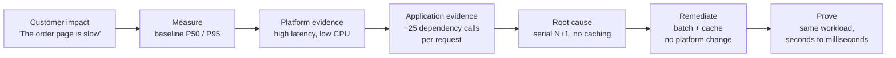

# Session 8 — Diagnose and Remediate Azure App Service Performance Issues

**Hands-on lab · 60 minutes · Instructor-led demonstration with self-paced follow-up**

---

## What this session is

A live, end-to-end walkthrough of how to investigate a "the application is slow" escalation
on Azure App Service — starting from customer impact, separating platform health from
application behaviour, finding the inefficient code path, fixing it, and proving the
improvement with the same workload.

You will watch the full investigation performed live. Afterwards you can run the identical
lab in your own subscription, at your own pace, using the participant guide and scripts
provided.

### The one idea

> An application can be slow on Azure App Service without App Service being the root cause.
> Start with customer impact, correlate platform and application evidence, identify the
> inefficient behaviour, remediate it, and prove the improvement using the same workload.

### What this session is not

This is a **controlled educational simulation**, purpose-built for teaching. It is not a
copy of any production architecture, and completing it does not validate any production
environment. What transfers is the **method**, not the numbers.

---

## Who should attend

Application developers, site reliability engineers, cloud operations engineers, and
technical leads who support or troubleshoot applications running on Azure App Service.

**Assumed background:** general familiarity with web applications and the Azure portal.
Deep .NET expertise is not required — the application is deliberately small, and every
line examined during the session is explained.

---

## Learning outcomes

By the end of the session you will be able to:

1. Turn a vague "it's slow" report into a measured baseline before changing anything.
2. Use App Service platform metrics to determine whether the platform is unhealthy or
   whether a healthy platform is hosting a slow application.
3. Interpret the signature of **high response time with low CPU** — waiting, not working.
4. Use Application Insights end-to-end transaction detail and KQL to find where request
   time is actually spent.
5. Recognise the N+1 access pattern, the most common performance defect in line-of-business
   applications, and explain why it is invisible without dependency telemetry.
6. Remediate the application behaviour without scaling the platform.
7. Prove an improvement credibly by re-running the identical workload.
8. Communicate root cause to a customer in one clear, non-technical sentence.

---

## Agenda (60 minutes)

| Time | Segment | What you will see |
|---|---|---|
| 0:00–0:05 | **Framing: the escalation** | The ticket, read as the customer wrote it. Why "can you scale it up?" is a solution arriving before any evidence |
| 0:05–0:12 | **Reproduce and measure** | The slow endpoint and a healthy control endpoint, side by side. A measured P50/P95 baseline replaces opinion |
| 0:12–0:22 | **Platform evidence** | App Service metrics: response time, CPU, memory, 5xx, requests. Ruling the platform in or out with data |
| 0:22–0:35 | **Application evidence** | Application Insights Performance blade, end-to-end transaction waterfall, and KQL showing dependency calls per request |
| 0:35–0:42 | **Name the root cause** | One sentence, in customer language. Then the fifteen lines of code that cause it |
| 0:42–0:50 | **Remediate** | Apply the fix. Explicitly *without* changing SKU, instance count, or any platform setting |
| 0:50–0:57 | **Prove it** | Identical workload, identical infrastructure, before/after comparison in both the load generator and the portal |
| 0:57–1:00 | **Close and cleanup** | Three takeaways, and deleting every resource on camera |

### The narrative arc



---

## Prerequisites

### To attend the live demonstration

**Nothing.** No Azure subscription, no software, no setup. The demonstration runs in the
presenter's subscription. Bring questions.

### To run the lab yourself afterwards

Everything below is required only for the self-paced version.

#### 1. Azure

| Requirement | Detail |
|---|---|
| Azure subscription | Any subscription where you can create resources |
| Permissions | **Contributor** on a subscription or on a resource group you can create resources in |
| Resource providers | `Microsoft.Web`, `Microsoft.Insights`, `Microsoft.OperationalInsights` registered |
| Region | Any region with Linux App Service availability. The lab has no region-specific dependencies |

#### 2. Local tooling

| Tool | Minimum version | Check with |
|---|---|---|
| Azure CLI | Any current release with Bicep support | `az version` |
| .NET SDK | 10.0 (LTS) | `dotnet --version` |
| PowerShell | **7.0+** (required — not Windows PowerShell 5.1) | `pwsh --version` |
| Git | any recent | `git --version` |

Bash equivalents of every script are provided, so macOS and Linux are fully supported.

> **Why PowerShell 7 specifically:** the deployment packaging step produces a zip archive
> that Linux App Service must be able to read. Windows PowerShell 5.1 writes archive paths
> in a format Linux rejects. The scripts enforce this and will stop with a clear message.

#### 3. Network

The load generator runs on **your machine** and sends HTTPS requests to your App Service.
If your corporate network restricts outbound HTTPS or inspects TLS, reduce concurrency or
generate load by refreshing the endpoint in a browser — the pattern is still visible.

#### 4. Before you start

```powershell
az login
az account set --subscription "<your-subscription>"
git clone https://github.com/dvazqueb11/azure-app-service-performance-lab
cd azure-app-service-performance-lab
```

Optional, costs nothing, catches problems early:

```powershell
./scripts/deploy.ps1 -ResourceGroup rg-perflab-test -Location eastus -ValidateOnly
```

---

## What gets deployed

Five minutes, one disposable resource group, four resources:

| Resource | Why it is needed |
|---|---|
| Linux App Service Plan | Hosts the application. `B1` by default |
| App Service | The application under investigation |
| Application Insights | Request, dependency, and trace telemetry — the heart of the lab |
| Log Analytics workspace | Required backing store for Application Insights |

Nothing else. No databases, no networking, no gateways, no container registry. The
dependency that appears slow is **simulated in-process**, so there is no external service
to deploy, pay for, or troubleshoot.

### Cost and safety

The lab is designed to be disposable and inexpensive:

- Single instance, autoscale **disabled** by default
- Telemetry ingestion capped at 1 GB/day, 30-day retention
- HTTPS-only, TLS 1.2 minimum, FTPS disabled
- Everything lives in **one resource group** — deleting it removes the entire lab

**Cost drivers** are the App Service Plan runtime (billed hourly from creation until
deletion), Application Insights ingestion, and Log Analytics retention. A typical run is
well under an hour.

> **Clean up as soon as you finish.** The App Service Plan bills by the hour whether or not
> you are using it.
>
> ```powershell
> ./scripts/cleanup.ps1 -ResourceGroup rg-perflab-<yourname>
> ```

---

## Materials you receive

| Document | Use it for |
|---|---|
| [`participant-lab.md`](participant-lab.md) | The self-paced lab: eight steps, with questions to answer and tables to fill in |
| [`solution-guide.md`](solution-guide.md) | Model answers to every question — try the lab first |
| [`kql-queries.md`](kql-queries.md) | Seven ready-to-run Application Insights queries, copy-paste |
| [`cost-and-cleanup.md`](cost-and-cleanup.md) | Cost drivers, SKU trade-offs, and removal verification |
| [`instructor-guide.md`](instructor-guide.md) | The full runsheet, if you want to deliver this to your own team |

Self-paced completion takes **45–60 minutes**, including deployment.

---

## Three things to take away

1. **Start with customer impact.** Turn "slow" into a measured baseline before touching
   anything.
2. **Separate platform health from application behaviour.** High response time with low CPU
   means the request is waiting, not working — and you cannot fix waiting by buying CPU.
3. **Prove the fix with the same workload.** A fix you cannot measure is a story, not an
   outcome.
